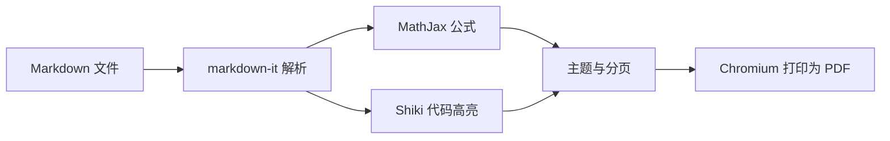

<div align="center">

# Markdown To PDF

在 VS Code 中实时预览 Markdown，并导出排版完整的 PDF。

[](https://github.com/CirnoNine9/markdown2pdf/releases/latest)
[](https://code.visualstudio.com/)
[](https://www.typescriptlang.org/)

[功能特性](#功能特性) · [快速开始](#快速开始) · [配置](#配置) · [本地开发](#本地开发)

</div>

Markdown To PDF 是一个专注于高质量排版的 VS Code 扩展。它使用 MathJax 渲染数学公式、Shiki 高亮代码，并提供适合论文与报告的学术主题，以及带自动分页的 4:3 Beamer 幻灯片主题。

## 功能特性

- **实时预览**：在编辑器旁打开预览，文档修改后自动刷新并保留滚动位置。
- **多种导出入口**：可通过侧边栏、命令面板或资源管理器右键菜单导出 `.md` 和 `.markdown` 文件。
- **数学公式**：MathJax 资源随扩展本地加载，支持常用 TeX 行内公式与块级公式。
- **代码高亮**：使用 Shiki 渲染围栏代码块，可选择任意可用的 Shiki 主题。
- **完整 Markdown 排版**：支持表格、任务列表、脚注、自动链接、删除线、图片和受控的内嵌 HTML。
- **本地与远程图片**：相对图片路径以当前 Markdown 文件所在目录为基准解析。
- **自动目录与页码**：可在侧边栏中生成目录页，并为目录项填充对应页码。
- **导出前检查**：公式渲染失败、图片无法加载或 Beamer 页面溢出时会给出错误提示。
- **浏览器自动发现**：优先使用系统中的 Chrome、Edge 或 Chromium；未找到时可按提示安装扩展管理的 Chromium。

## 主题

| 主题 | 适用场景 | 页面布局 | 默认页码 |
| --- | --- | --- | --- |
| `academic` | 论文、报告、笔记、技术文档 | A4，可配置纸张和页边距 | 开启 |
| `beamer` | 演示文稿、课程讲义 | 128 × 96 mm，4:3 横向幻灯片 | 关闭 |

Beamer 主题会根据一级、二级和三级标题组织幻灯片，并在内容超过单页容量时自动拆分。可参考仓库中的 [Beamer Markdown](samples/beamer.md) 与 [导出效果](samples/beamer.pdf)。学术文档示例见 [complex.md](samples/complex.md) 与 [complex.pdf](samples/complex.pdf)。

## 快速开始

### 安装

1. 打开项目的 [Releases](https://github.com/CirnoNine9/markdown2pdf/releases/latest) 页面并下载最新扩展安装包。
2. 在 VS Code 中打开扩展视图，点击右上角 `...`，选择 **Install from VSIX...**。
3. 选择下载的安装包并按提示完成安装。

要求 VS Code 1.92.0 或更高版本。导出 PDF 还需要 Chrome、Edge 或 Chromium；如果系统中没有可用浏览器，扩展会询问是否自动安装 Chromium。

### 预览与导出

1. 在 VS Code 中打开一个已保存的 Markdown 文件。
2. 点击编辑器标题栏中的预览按钮，或运行命令 `Markdown To PDF: 打开实时预览`。
3. 在活动栏打开 **Markdown To PDF**，选择输出位置、主题、目录和页码选项。
4. 点击 **导出 PDF**。

也可以使用以下入口：

- 在命令面板运行 `Markdown To PDF: Export Current Markdown`。
- 在资源管理器中右键 `.md` 或 `.markdown` 文件，选择 `Markdown To PDF: Export Markdown File`。

导出结束后，可直接打开 PDF，或在系统文件管理器中定位文件。

## 支持的公式写法

行内公式：

```markdown
质能方程为 $E = mc^2$，也可以写成 \(E = mc^2\)。
```

未转义且成对出现的 `$...$` 始终按行内公式解析，公式内容是否有效由 MathJax 判断。普通美元符号请写成 `\$`，例如：

```markdown
价格范围是 \$5-\$10，计算结果是 $5-10$。
```

没有配对的单个 `$` 会保留为普通文本；在同一行混用货币与公式时，仍建议始终转义货币美元符号以避免歧义。

块级公式：

```markdown
$$
\int_0^1 x^2\,dx = \frac{1}{3}
$$
```

也支持使用 `\[` 与 `\]` 包围块级公式。MathJax 启用了 AMS 与 mathtools 扩展，可用于对齐公式、矩阵等常见数学排版。

## 配置

在 VS Code 设置中搜索 `Markdown To PDF`，或在工作区设置中使用以下配置项：

| 配置项 | 默认值 | 说明 |
| --- | --- | --- |
| `markdown2pdf.theme` | `academic` | 内置主题：`academic` 或 `beamer` |
| `markdown2pdf.codeTheme` | `github-light` | Shiki 代码高亮主题 |
| `markdown2pdf.pageFormat` | `A4` | 学术主题的纸张格式，如 `A4`、`Letter`、`Legal` |
| `markdown2pdf.margin` | 四边 `18mm` | 学术主题的上、右、下、左页边距 |
| `markdown2pdf.fontFamily` | `Inter, ...` | 导出文档使用的 CSS 字体族 |
| `markdown2pdf.beamerFooterText` | 空 | Beamer 左下角页脚文字，换行可显示两行 |
| `markdown2pdf.customCssFile` | 空 | 在内置主题之后加载的自定义 CSS 文件路径 |
| `markdown2pdf.chromePath` | 空 | 指定 Chrome、Edge 或 Chromium 可执行文件路径 |

示例：

```json
{
  "markdown2pdf.theme": "academic",
  "markdown2pdf.codeTheme": "github-light",
  "markdown2pdf.pageFormat": "A4",
  "markdown2pdf.margin": {
    "top": "20mm",
    "right": "18mm",
    "bottom": "20mm",
    "left": "18mm"
  },
  "markdown2pdf.fontFamily": "Inter, Segoe UI, sans-serif"
}
```

> Beamer 主题使用固定的 4:3 页面尺寸和零页边距，因此 `pageFormat` 与 `margin` 不会改变它的版式。

## 工作方式



Markdown 会先转换为经过清理的 HTML，再加载本地主题、MathJax 与代码高亮结果。最终由无头 Chromium 打印为 PDF，因此表格、图片、字体和自定义 CSS 能保持接近浏览器的排版效果。

## 本地开发

准备 Node.js、npm 和 VS Code，然后执行：

```powershell
npm install
npm run package
```

`npm run package` 会依次完成 TypeScript 类型检查、Vitest 测试和扩展构建。也可以在 VS Code 中打开项目并按 `F5`，在扩展开发宿主中调试。

常用命令：

| 命令 | 用途 |
| --- | --- |
| `npm run build` | 构建扩展并复制运行时资源 |
| `npm run watch` | 监听源码变化并持续构建 |
| `npm run typecheck` | 执行 TypeScript 类型检查 |
| `npm test` | 运行测试 |
| `npm run package` | 完成类型检查、测试与构建 |

## 项目结构

```text
markdown2pdf/
├─ resources/     # 扩展图标等资源
├─ samples/       # Markdown 与 PDF 示例
├─ scripts/       # 构建资源复制脚本
├─ src/           # 扩展、预览、渲染与导出源码
├─ test/          # Vitest 测试
├─ package.json   # 扩展清单与 npm 脚本
└─ tsconfig.json  # TypeScript 配置
```

## 反馈

如果遇到渲染错误、排版问题或有功能建议，请提交 [Issue](https://github.com/CirnoNine9/markdown2pdf/issues)，并尽量附上最小可复现的 Markdown、操作系统、VS Code 版本和浏览器版本。
